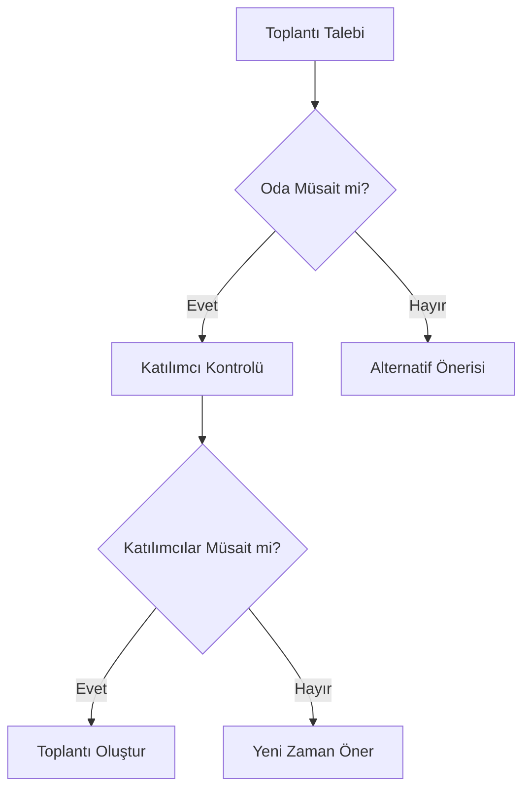
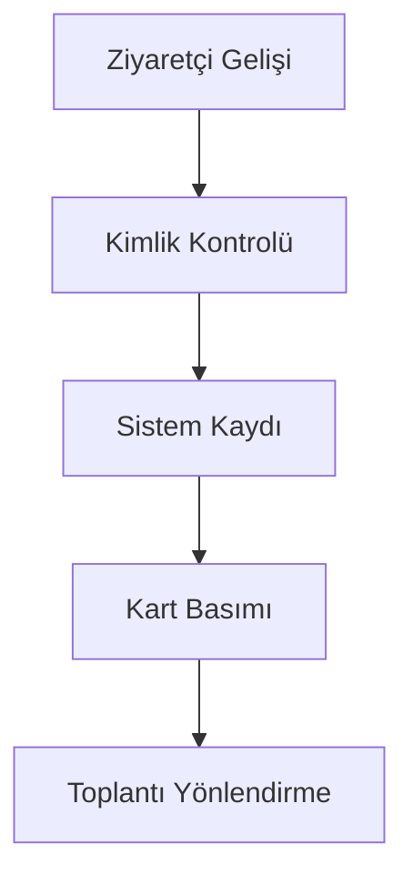

# Sistem Önerileri ve İşleyiş Rehberi 🎯

## Genel Sistem İşleyişi 🔄

### 1. Kullanıcı Rolleri ve İzinler
- **Sistem Yöneticisi**
  - Tüm sistem ayarlarına erişim
  - Kullanıcı yönetimi
  - Raporlama ve analiz
  - Güvenlik ayarları

- **Toplantı Yöneticisi**
  - Toplantı oluşturma/düzenleme
  - Katılımcı yönetimi
  - Oda rezervasyonu
  - Raporlama

- **Ziyaretçi Yöneticisi**
  - Ziyaretçi kaydı
  - Ziyaretçi takibi
  - Güvenlik kontrolü
  - Raporlama

- **Standart Kullanıcı**
  - Toplantı görüntüleme
  - Toplantıya katılma
  - Not alma
  - Temel raporlar

### 2. Sistem Akışı
1. **Kullanıcı Girişi**
   - JWT token bazlı authentication
   - Rol bazlı yetkilendirme
   - İki faktörlü doğrulama (opsiyonel)

2. **Ana Dashboard**
   - Günlük toplantı özeti
   - Aktif ziyaretçiler
   - Oda durumları
   - Hızlı işlem menüsü

3. **Bildirim Sistemi**
   - Email bildirimleri
   - SMS bildirimleri
   - Push notifications
   - In-app bildirimler

## Toplantı Yönetimi 📅

### 1. Toplantı Oluşturma Süreci

### 2. Toplantı Türleri
- **Standart Toplantı**
  - Tek seferlik
  - Belirli süre
  - Sabit katılımcılar

- **Tekrarlı Toplantı**
  - Günlük/Haftalık/Aylık
  - Otomatik oluşturma
  - Esnek katılımcılar

- **Acil Toplantı**
  - Hızlı oluşturma
  - Öncelikli bildirim
  - Esnek oda seçimi

### 3. Toplantı Özellikleri
- **Temel Bilgiler**
  - Başlık ve açıklama
  - Tarih ve saat
  - Süre ve lokasyon
  - Katılımcılar

- **Gelişmiş Özellikler**
  - Dosya ekleri
  - Gündem maddeleri
  - Toplantı notları
  - Video konferans bağlantısı

## Ziyaretçi Yönetimi 👥

### 1. Ziyaretçi Kaydı

### 2. Ziyaretçi Türleri
- **Tek Seferlik Ziyaretçi**
  - Hızlı kayıt
  - Geçici kart
  - Sınırlı erişim

- **Düzenli Ziyaretçi**
  - Detaylı profil
  - Kalıcı kart
  - Genişletilmiş erişim

- **VIP Ziyaretçi**
  - Özel karşılama
  - Tam erişim
  - Özel hizmetler

### 3. Ziyaretçi Takibi
- **Giriş/Çıkış Kontrolü**
  - QR kod ile giriş
  - NFC kart okuma
  - Biyometrik doğrulama

- **Güvenlik Kontrolleri**
  - Kara liste kontrolü
  - Güvenlik taraması
  - Erişim log'ları

## Toplantı Odası Yönetimi 🏢

### 1. Oda Kategorileri
- **Küçük Odalar (2-4 kişi)**
  - Hızlı görüşmeler
  - Video görüşmeler
  - Birebir toplantılar

- **Orta Boy Odalar (5-10 kişi)**
  - Departman toplantıları
  - Proje toplantıları
  - Eğitim oturumları

- **Büyük Odalar (10+ kişi)**
  - Genel toplantılar
  - Sunumlar
  - Konferanslar

### 2. Oda Özellikleri
- **Temel Ekipmanlar**
  - Projeksiyon/Ekran
  - Video konferans sistemi
  - Ses sistemi
  - Whiteboard

- **Akıllı Özellikler**
  - Otomatik ışık kontrolü
  - Klima kontrolü
  - Hareket sensörleri
  - Akıllı kilit sistemi

### 3. Oda Rezervasyon Kuralları
- Minimum rezervasyon süresi: 30 dakika
- Maksimum rezervasyon süresi: 4 saat
- Rezervasyon iptali: En az 2 saat önce
- Otomatik iptal: 15 dakika check-in yapılmazsa

## Raporlama ve Analiz 📊

### 1. Toplantı Raporları
- Toplantı sıklığı analizi
- Katılım oranları
- Toplantı verimliliği
- Maliyet analizi

### 2. Ziyaretçi Raporları
- Ziyaretçi trafiği
- Ziyaret süreleri
- Ziyaret amaçları
- Güvenlik istatistikleri

### 3. Oda Kullanım Raporları
- Doluluk oranları
- Peak saatler
- Ekipman kullanımı
- Enerji tüketimi

## Sistem Optimizasyonu 🔧

### 1. Performans İyileştirmeleri
- **Database Optimizasyonu**
  - Index stratejisi
  - Query optimizasyonu
  - Caching mekanizması

- **Uygulama Performansı**
  - Lazy loading
  - Code splitting
  - Image optimization

### 2. Otomasyon Önerileri
- **Toplantı Otomasyonu**
  - Otomatik oda önerisi
  - Akıllı zamanlama
  - Otomatik hatırlatmalar

- **Ziyaretçi Otomasyonu**
  - Otomatik check-in
  - Dijital form doldurma
  - Otomatik kart basımı

### 3. İş Akışı İyileştirmeleri
- **Onay Süreçleri**
  - Paralel onay akışı
  - Otomatik eskalasyon
  - Mobil onay

- **Entegrasyon Süreçleri**
  - Takvim senkronizasyonu
  - Email entegrasyonu
  - Chat entegrasyonu

## Güvenlik Önlemleri 🔒

### 1. Sistem Güvenliği
- Düzenli güvenlik taramaları
- Güvenlik duvarı konfigürasyonu
- SSL/TLS sertifikaları
- Veri şifreleme

### 2. Fiziksel Güvenlik
- Kamera sistemleri
- Kartlı geçiş sistemi
- Güvenlik personeli
- Acil durum prosedürleri

### 3. Veri Güvenliği
- Yedekleme stratejisi
- Veri saklama politikası
- KVKK uyumluluğu
- Veri sınıflandırma

## Bakım ve Destek 🛠

### 1. Rutin Bakım
- Günlük sistem kontrolü
- Haftalık yedekleme
- Aylık performans analizi
- Üç aylık güvenlik denetimi

### 2. Destek Süreçleri
- 7/24 teknik destek
- Kullanıcı eğitimleri
- Dokümantasyon güncellemeleri
- Sorun takip sistemi
